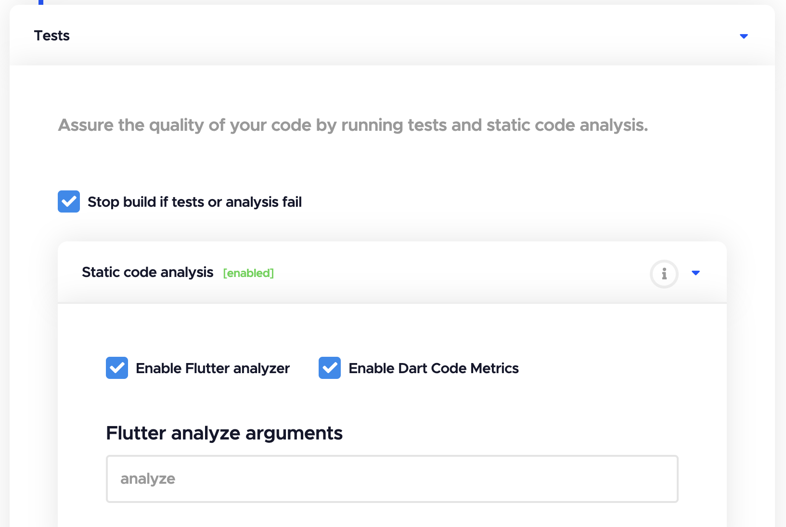
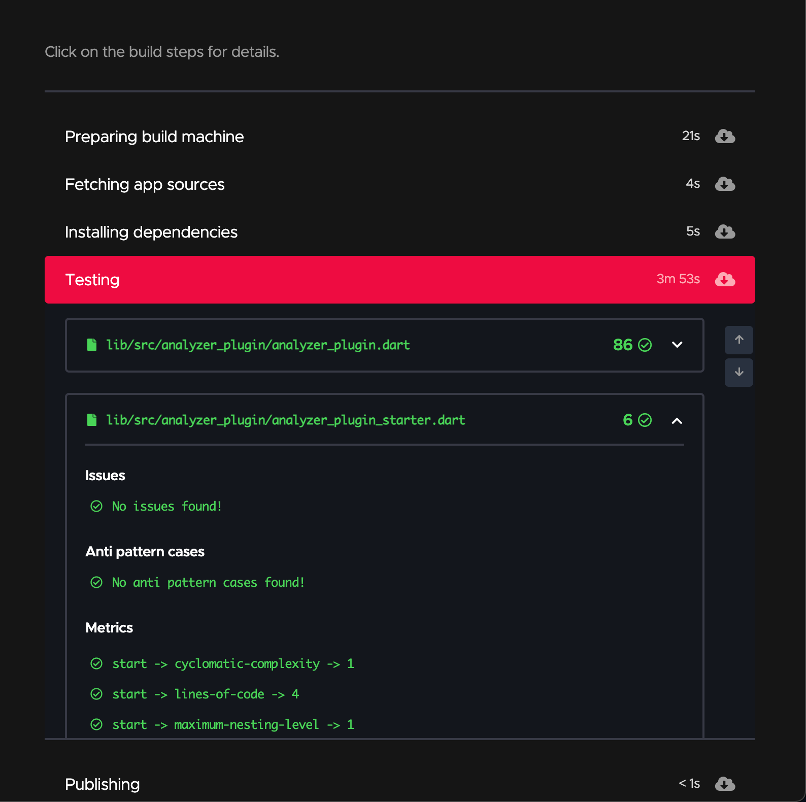
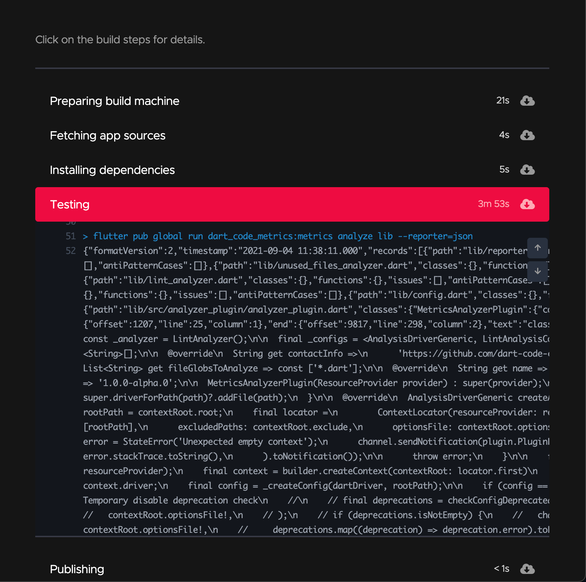

# Codemagic

[Codemagic](http://codemagic.io/) is a CI/CD solution which helps you test and release your Flutter apps with zero configuration and no pain.

## Usage {#usage}

### With `codemagic.yaml`

To enable Flutterando Metrics add the following script to `codemagic.yaml`

```yml title="codemagic.yaml"
scripts:
  - echo 'previous step'
  - name: Flutterando Metrics
    script: |
      mkdir -p metrics-results
      flutter pub run flutterando_metrics:metrics analyze lib --reporter=json > metrics-results/flutterando_metrics.json
    test_report: metrics-results/flutterando_metrics.json
```

check out [Codemagic docs](https://docs.codemagic.io/yaml-testing/dart-code-metrics/) for more details about `codemagic.yaml` setup.

### With the Flutter workflow editor

To enable Flutterando Metrics check the `Enable Flutterando Metrics` option:



check out [Codemagic docs](https://docs.codemagic.io/flutter-testing/static-code-analysis/#dart-code-metrics) for more details about the Flutter workflow editor setup.

### Output example {#output-example}

#### Results preview {#results-preview}




#### Logs {#logs}


