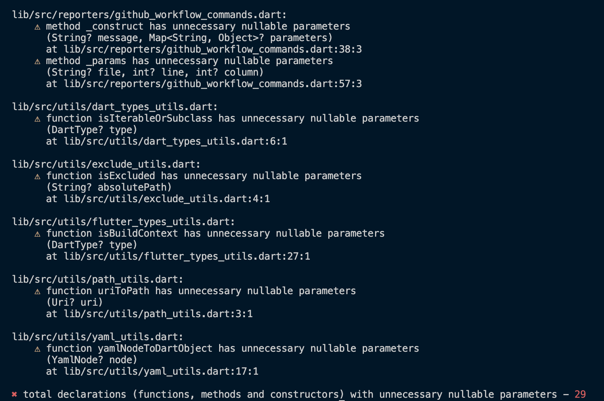

# Verifique parâmetros nulos desnecessários

Verifica parâmetros nulos desnecessários em funções, métodos e construtores. A remoção de nuláveis ​​desnecessários pode ajudar a reduzir a quantidade de verificações no código.

Para executar o comando, execute

```sh
$ dart run flutterando_metrics:metrics check-unnecessary-nullable lib

# ou para um pacote Flutter
$ flutter pub run flutterando_metrics:metrics check-unnecessary-nullable lib
```

Descrição completa do comando:

```text
Uso: metrics check-unnecessary-nullable [argumentos] <diretórios>
-h, --help                                       Exibe esta informação de uso.


-r, --reporter=<console>                         O formato da saída da análise.
                                                 [console (padrão), json]

-c, --print-config                               Exibe a configuração resolvida.


    --root-folder=<./>                           Pasta raiz.
                                                 (padrão é o diretório atual)
    --sdk-path=<caminho-do-diretório>            Caminho do diretório do SDK Dart. Deve ser fornecido apenas quando você executa o aplicativo como executável compilado (https://dart.dev/tools/dart-compile#exe) e a detecção automática do caminho do SDK Dart falha.
    --exclude=<{/**.g.dart,/**.freezed.dart}>    Caminhos de arquivos em sintaxe Glob para serem excluídos.
                                                 (padrão é "{/**.g.dart,/**.freezed.dart}")


    --no-congratulate                            Não mostrar saída mesmo quando não houver problemas.


    --[no-]monorepo                              Trata todo o código exportado com parâmetros como não nulável por padrão.


    --[no-]fatal-found                           Trata parâmetros nulos desnecessários encontrados como fatais.
```

## Suprimindo o comando

Para suprimir o comando, adicione o comentário `ignore: unnecessary-nullable`. Para suprimir para um arquivo inteiro, adicione `ignore_for_file: unnecessary-nullable` ao início de um arquivo.

## Suporte a Monorepo

Por padrão, o comando trata todo o código que é exportado do pacote como usado. Para desabilitar este comportamento, use a flag `--monorepo`. Isso pode ser útil quando todos os pacotes em seu repositório são usados apenas dentro do repositório e não são publicados no pub.

## Exemplo de saída {#output-example}

### Console {#console}

Use `--reporter=console` para habilitar este formato.



### JSON {#json}

O repórter imprime um único objeto JSON contendo informações meta e os parâmetros nuláveis ​​desnecessários. Use `--reporter=json` para habilitar este formato.

#### Os campos do objeto **root** são {#the-root-object-fields-are}

- `formatVersion` - um inteiro representando a versão do formato (será incrementado cada vez que o formato de serialização mudar)
- `timestamp` - a data e hora de criação do relatório no formato AAAA-MM-DD HH:MM:SS
- `unnecessaryNullable` - um array de [problemas de nulável desnecessários](#the-unnecessarynullable-object-fields-are)

```JSON
{
  "formatVersion": 2,
  "timestamp": "2021-04-11 14:44:42",
  "unnecessaryNullable": [
    {
      ...
    },
    {
      ...
    },
    {
      ...
    }
  ]
}
```

#### Os campos do objeto **unnecessaryNullable** são {#the-unnecessarynullable-object-fields-are}

- `path` - um caminho relativo do arquivo com a declaração de parâmetros nuláveis ​​desnecessários
- `issues` - um array de [problemas](#the-issue-object-fields-are) detectados na classe alvo

```JSON
{
  "path": "lib/src/some/class.dart",
  "issues": [
    ...
  ],
}
```

#### Os campos do objeto **issue** são {#the-issue-object-fields-are}

- `declarationName` - o nome de uma declaração com parâmetros nuláveis ​​desnecessários
- `declarationType` - o tipo de uma declaração com parâmetros nuláveis ​​desnecessários (função, método ou construtor)
- `parameters` - um array de strings representando parâmetros marcados como nuláveis
- `offset` - um offset baseado em zero da localização do membro da classe no código
- `line` - uma linha baseada em zero da localização do membro da classe no código
- `column` - uma coluna baseada em zero da localização do membro da classe no código

```JSON
{
  "declarationName": "someFunction",
  "declarationType": "function",
  "parameters": "[String? value]",
  "offset": 156,
  "line": 7,
  "column": 1
}
```
