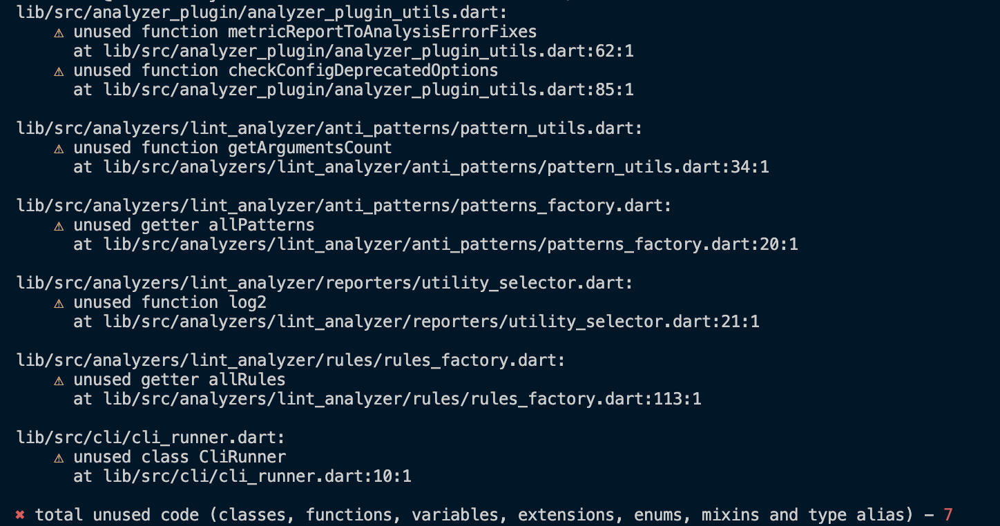

# Verifique código não utilizado

Verifica classes, funções, variáveis de nível superior, extensões, enums, mixins e aliases de tipo não utilizados.

**Nota:** a implementação atual não verifica o uso de métodos de classe específicos. Além disso, trata o código que é importado com importações condicionais não nomeadas como não usado. Isso será corrigido nas futuras versões.

Para executar o comando, execute:

```sh
$ dart run flutterando_metrics:metrics check-unused-code lib

# ou para um pacote Flutter
$ flutter pub run flutterando_metrics:metrics check-unused-code lib
```

Descrição completa do comando:

```text
Uso: metrics check-unused-code [argumentos] <diretórios>
-h, --help                                       Exibe esta informação de uso.

-r, --reporter=<console>                         O formato da saída da análise.
                                                 [console (padrão), json]
    --report-to-file=<path/to/report.json>       O caminho, onde um arquivo JSON com o resultado da análise será colocado (apenas para o repórter JSON).

-c, --print-config                               Exibe a configuração resolvida.

    --root-folder=<./>                           Pasta raiz.
                                                 (padrão é o diretório atual)
    --sdk-path=<caminho-do-diretório>            Caminho do diretório do SDK Dart.
                                                 Deve ser fornecido apenas quando você executa o aplicativo como executável compilado (https://dart.dev/tools/dart-compile#exe) e a detecção automática do caminho do SDK Dart falha.
    --exclude=<{/**.g.dart,/**.freezed.dart}>    Caminhos de arquivos em sintaxe Glob para serem excluídos.
                                                 (padrão é "{/**.g.dart,/**.freezed.dart}")


    --no-congratulate                            Não mostrar saída mesmo quando não houver problemas.

    --[no-]monorepo                              Trata todo o código exportado como não utilizado por padrão.

    --[no-]fatal-unused                          Trata arquivos não utilizados encontrados como fatais.
```

## Suprimindo o comando

Para suprimir o comando, adicione o comentário `ignore: unused-code`. Para suprimir para um arquivo inteiro, adicione `ignore_for_file: unused-code` ao início de um arquivo.

## Suporte a Monorepo

Por padrão, o comando trata todo o código que é exportado do pacote como usado. Para desabilitar este comportamento, use a flag `--monorepo`. Isso pode ser útil quando todos os pacotes em seu repositório são usados apenas dentro do repositório e não são publicados no pub.

## Exemplo de saída {#output-example}

### Console {#console}

Use `--reporter=console` para habilitar este formato.



### JSON {#json}

O repórter imprime um único objeto JSON contendo informações meta e os caminhos dos arquivos de código não utilizados. Use `--reporter=json` para habilitar este formato.

#### Os campos do objeto **root** são {#the-root-object-fields-are}

- `formatVersion` - um inteiro representando a versão do formato (será incrementado cada vez que o formato de serialização mudar)
- `timestamp` - a data e hora de criação do relatório no formato AAAA-MM-DD HH:MM:SS
- `unusedCode` - um array de [problemas de código não utilizado](#the-unusedcode-object-fields-are)

```JSON
{
  "formatVersion": 2,
  "timestamp": "2021-04-11 14:44:42",
  "unusedCode": [
    {
      ...
    },
    {
      ...
    },
    {
      ...
    }
  ]
}
```

#### Os campos do objeto **unusedCode** são {#the-unusedcode-object-fields-are}

- `path` - um caminho relativo do arquivo não utilizado
- `issues` - um array de [problemas](#the-issue-object-fields-are) detectados no arquivo alvo

```JSON
{
  "path": "lib/src/some/file.dart",
  "issues": [
    ...
  ],
}
```

#### Os campos do objeto **issue** são {#the-issue-object-fields-are}

- `declarationType` - tipo de declaração não utilizada
- `declarationName` - nome da declaração não utilizada
- `offset` - um offset baseado em zero da localização do membro da

 classe na fonte
- `line` - uma linha baseada em zero da localização do membro da classe na fonte
- `column` - uma coluna baseada em zero da localização do membro da classe na fonte

```JSON
{
  "declarationType": "extension",
  "declarationName": "StringX",
  "offset": 156,
  "line": 7,
  "column": 1
}
```
