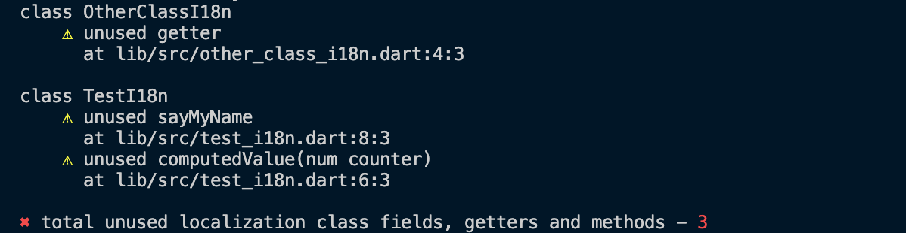

# Verifique l10n não utilizado

Verifica membros não utilizados da classe Dart, que encapsulam os valores localizados do aplicativo.

Um exemplo de tal classe:

```dart
class ClassWithLocalization {
  String get title {
    return Intl.message(
      'Hello World',
      name: 'title',
      desc: 'Título para o aplicativo de demonstração',
      locale: localeName,
    );
  }
}
```

Leia mais sobre essa abordagem de localização [na documentação do Flutter](https://flutter.dev/docs/development/accessibility-and-localization/internationalization#defining-a-class-for-the-apps-localized-resources).

Por padrão, o comando procura por classes que terminam com `I18n`, mas você pode substituir esse comportamento com o argumento `--class-pattern`.

Para executar o comando, execute:

```sh
$ dart run flutterando_metrics:metrics check-unused-l10n lib

# ou para um pacote Flutter
$ flutter pub run flutterando_metrics:metrics check-unused-l10n lib
```

Descrição completa do comando:

```text
Uso: metrics check-unused-l10n [argumentos] <diretórios>
-h, --help                                       Exibe esta informação de uso.

-p, --class-pattern=<I18n$>                      O padrão para detectar classes fornecendo localização
                                                 (padrão é "I18n$")

-r, --reporter=<console>                         O formato da saída da análise.
                                                 [console (padrão), json]
    --report-to-file=<caminho/para/report.json>  O caminho, onde um arquivo JSON com o resultado da análise será colocado (apenas para o repórter JSON).

-c, --print-config                               Exibe a configuração resolvida.

    --root-folder=<./>                           Pasta raiz.
                                                 (padrão é o diretório atual)
    --sdk-path=<caminho-do-diretório>            Caminho do diretório do SDK Dart.
                                                 Deve ser fornecido apenas quando você executa o aplicativo como executável compilado (https://dart.dev/tools/dart-compile#exe) e a detecção automática do caminho do SDK Dart falha.
    --exclude=<{/**.g.dart,/**.freezed.dart}>    Caminhos de arquivos em sintaxe Glob para serem excluídos.
                                                 (padrão é "{/**.g.dart,/**.freezed.dart}")


    --no-congratulate                            Não mostrar saída mesmo quando não houver problemas.

    --[no-]fatal-unused                          Trata l10n não utilizado encontrado como fatal.
```

## Exemplo de saída {#output-example}

### Console {#console}

Use `--reporter=console` para habilitar este formato.



### JSON {#json}

O repórter imprime um único objeto JSON contendo informações meta e os caminhos dos arquivos não utilizados. Use `--reporter=json` para habilitar este formato.

#### Os campos do objeto **root** são {#the-root-object-fields-are}

- `formatVersion` - um inteiro representando a versão do formato (será incrementado cada vez que o formato de serialização mudar)
- `timestamp` - a data e hora de criação do relatório no formato AAAA-MM-DD HH:MM:SS
- `unusedLocalizations` - um array de [arquivos não utilizados](#the-unusedlocalizations-object-fields-are)

```JSON
{
  "formatVersion": 2,
  "timestamp": "2021-04-11 14:44:42",
  "unusedLocalizations": [
    {
      ...
    },
    {
      ...
    },
    {
      ...
    }
  ]
}
```

#### Os campos do objeto **unusedLocalizations** são {#the-unusedlocalizations-object-fields-are}

- `path` - um caminho relativo do arquivo não utilizado
- `className` - um nome da classe que tem membros não utilizados
- `issues` - um array de [problemas](#the-issue-object-fields-are) detectados na classe alvo

```JSON
{
  "path": "lib/src/some/class.dart",
  "className": "class",
  "issues": [
    ...
  ],
}
```

#### Os campos do objeto **issue** são {#the-issue-object-fields-are}

- `memberName` - nome do membro da classe não utilizado
- `offset` - um deslocamento baseado em zero da localização do membro da classe na fonte
- `line` - uma linha baseada em zero da localização do membro da classe na fonte
- `column` - uma coluna baseada em zero da localização do membro da classe na fonte

```JSON
{
  "memberName": "someGetter",
  "offset": 156,
  "line": 7,
  "column": 1
}
```
