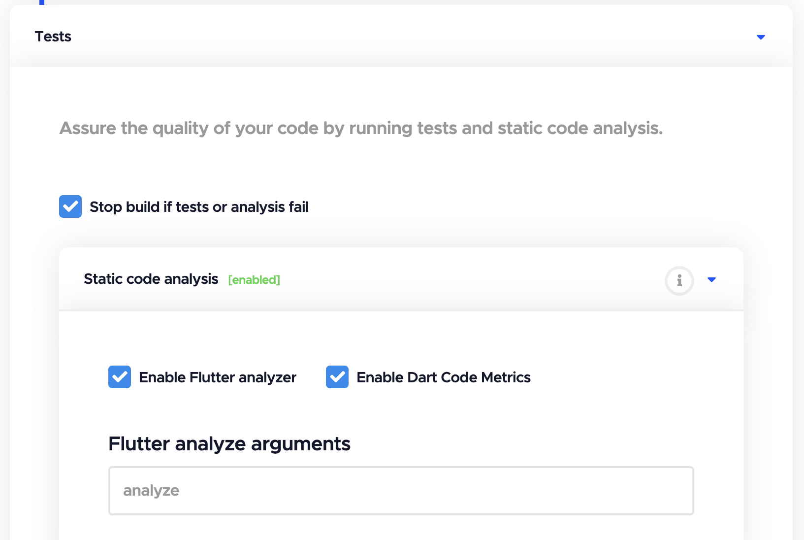
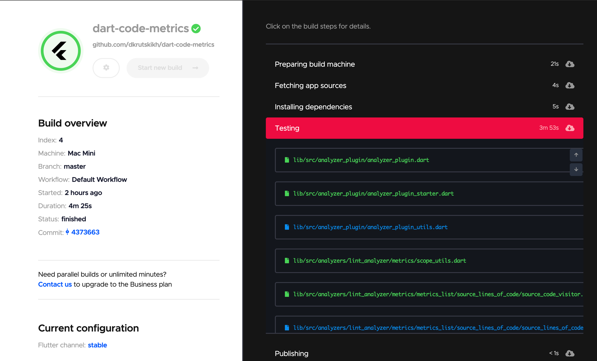
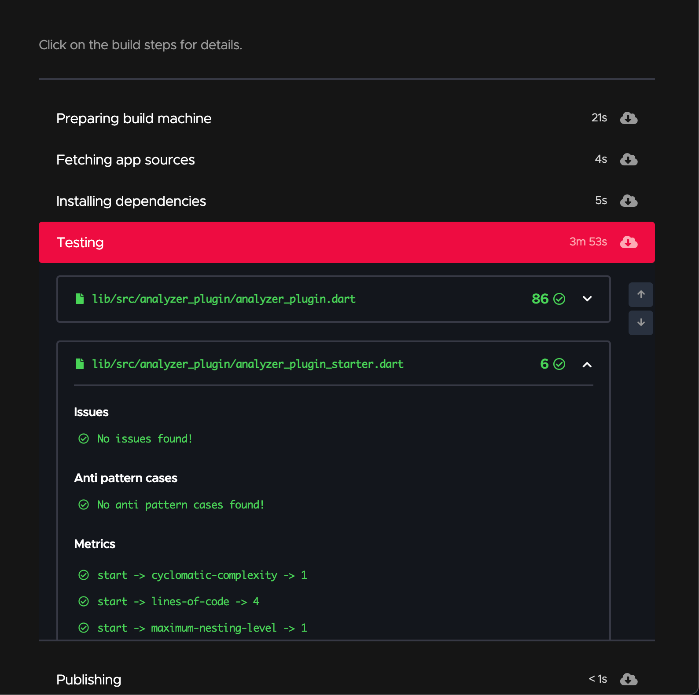
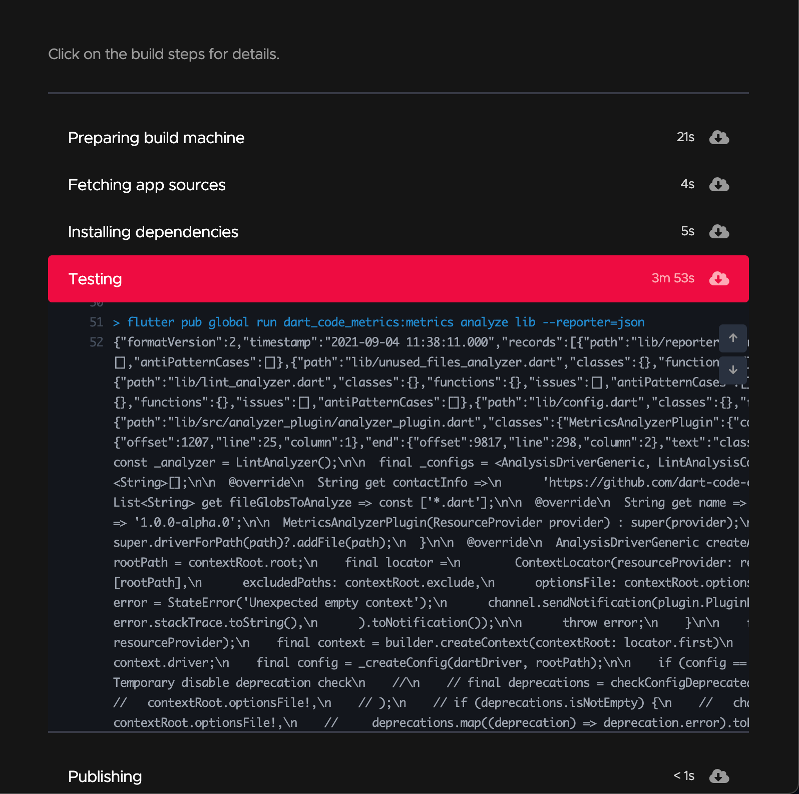

# Codemagic

[Codemagic](http://codemagic.io/) é uma solução CI/CD que ajuda você a testar e lançar seus aplicativos Flutter com zero configuração e sem complicações.

## Uso {#usage}

### Com `codemagic.yaml`

Para habilitar o Flutterando Metrics, adicione o seguinte script ao `codemagic.yaml`

```yml title="codemagic.yaml"
scripts:
  - echo 'etapa anterior'
  - name: Flutterando Metrics
    script: |
      mkdir -p metrics-results
      flutter pub run flutterando_metrics:metrics analyze lib --reporter=json > metrics-results/flutterando_metrics.json
    test_report: metrics-results/flutterando_metrics.json
```

Confira a [documentação do Codemagic](https://docs.codemagic.io/yaml-testing/dart-code-metrics/) para obter mais detalhes sobre a configuração do `codemagic.yaml`.

### Com o editor de fluxo de trabalho do Flutter

Para habilitar o Flutterando Metrics, marque a opção `Enable Flutterando Metrics`:



Confira a [documentação do Codemagic](https://docs.codemagic.io/flutter-testing/static-code-analysis/#dart-code-metrics) para obter mais detalhes sobre a configuração do editor de fluxo de trabalho do Flutter.

### Exemplo de saída {#output-example}

#### Visualização dos resultados {#results-preview}





#### Registros {#logs}


