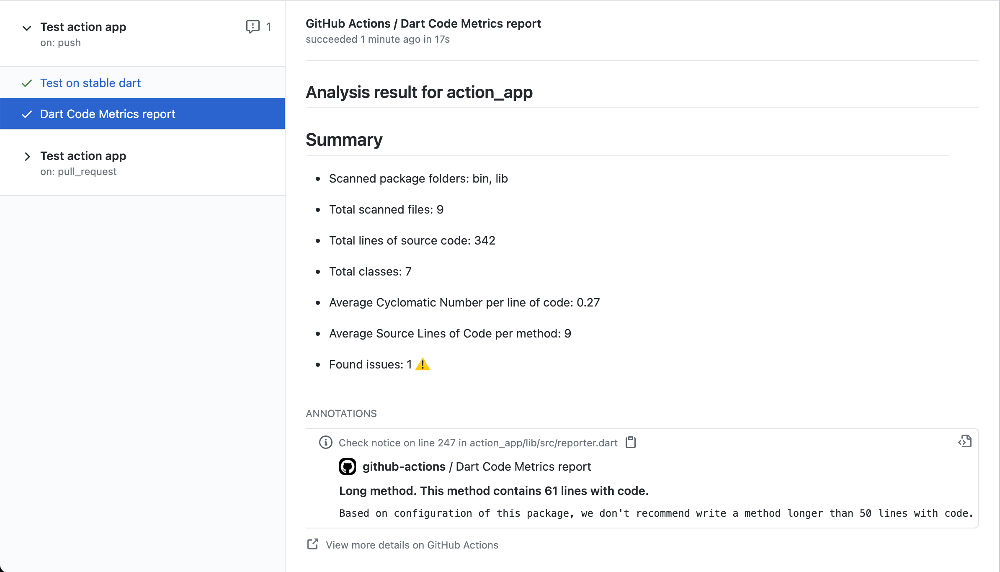
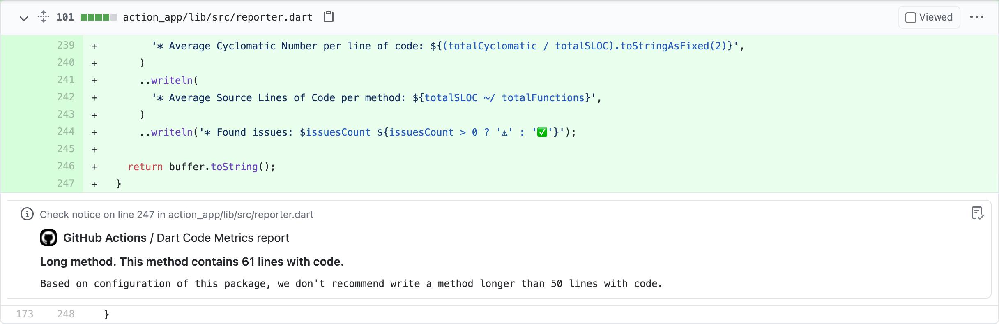

# GitHub Actions

[Action do GitHub do Flutterando Metrics](https://github.com/marketplace/actions/flutterando_metrics-action) permite que você integre o Flutterando Metrics em seu processo de CI/CD e obtenha relatórios de qualidade de código dentro dos PR's.

## Uso {#usage}

Crie o arquivo `flutterandometrics.yaml` em `.github/workflows` com o seguinte conteúdo (a configuração padrão listada):

```yml title="flutterandometrics.yaml"
name: Flutterando Metrics

on: [push]

jobs:
  check:
    name: flutterando_metrics-action

    runs-on: ubuntu-latest

    steps:
      - uses: actions/checkout@v3

      - name: flutterando_metrics
        uses: Flutterando/flutterando_metrics-action@v1
        with:
          github_token: ${{ secrets.GITHUB_TOKEN }}
```

### Entradas {#inputs}

| Nome                                  | Obrigatório                                                               | Descrição                                                                                                                                                                                                                                                                                                         | Padrão                                                  |
| :------------------------------------ | :------------------------------------------------------------------------ | :------------------------------------------------------------------------------------------------------------------------------------------------------------------------------------------------------------------------------------------------------------------------------------------------------------------ | :------------------------------------------------------ |
| **github_token**                      | ☑️                                                                         | Necessário para postar um relatório no GitHub. *Nota:* o segredo [`GITHUB_TOKEN`](https://help.github.com/en/actions/automating-your-workflow-with-github-actions/authenticating-with-the-github_token) já é fornecido pelo GitHub e você não precisa configurá-lo por conta própria.                                  |                                                         |
| **github_pat**                        | Obrigatório se você tiver um repositório GitHub privado nas dependências do pacote | [**Personal access token**](https://docs.github.com/en/github/authenticating-to-github/keeping-your-account-and-data-secure/creating-a-personal-access-token) deve ter acesso aos escopos *repo* e *read:user* [escopos](https://docs.github.com/en/developers/apps/building-oauth-apps/scopes-for-oauth-apps#available-scopes) |                                                         |
| **folders**                           |                                                                           | Lista de pastas cujo conteúdo será verificado.                                                                                                                                                                                                                                                                     | [`lib`]                                                 |
| **relative_path**                     |                                                                           | Se seu pacote não estiver na raiz do repositório, configure esta entrada para indicar sua localização.                                                                                                                                                                                                              |                                                         |
| **pull_request_comment**              |                                                                           | Publique um relatório detalhado comentado diretamente em seu pull request.                                                                                                                                                                                                                                         | `false`                                                 |
| **analyze_report_title_pattern**      |                                                                           | Padrão do título do relatório de análise configurável.                                                                                                                                                                                                                                                            | `Flutterando Metrics analyze report of $packageName`      |
| **fatal_warnings**                    |                                                                           | Trate problemas de nível de aviso como fatais.                                                                                                                                                                                                                                                                    | `false`                                                 |
| **fatal_performance**                 |                                                                           | Trate problemas de nível de desempenho como fatais.                                                                                                                                                                                                                                                              | `false`                                                 |
| **fatal_style**                       |                                                                           | Trate problemas de nível de estilo como fatais.                                                                                                                                                                                                                                                                  | `false`                                                 |
| **check_unused_files**                |                                                                           | Verificação adicional para encontrar arquivos não utilizados no pacote.                                                                                                                                                                                                                                           | `false`                                                 |
| **check_unused_files_folders**        |                                                                           | Lista de pastas cujo conteúdo será verificado para encontrar arquivos não utilizados.                                                                                                                                                                                                                             | Obtido do argumento `folders`                           |
| **unused_files_report_title_pattern** |                                                                           | Padrão do título do relatório de arquivos não utilizados configurável.                                                                                                                                                                                                                                           | `Flutterando Metrics unused files report of $packageName` |

### Exemplo de saída {#output-example}

#### Resultado da análise {#analysis-result}



#### Anotação {#annotation}


